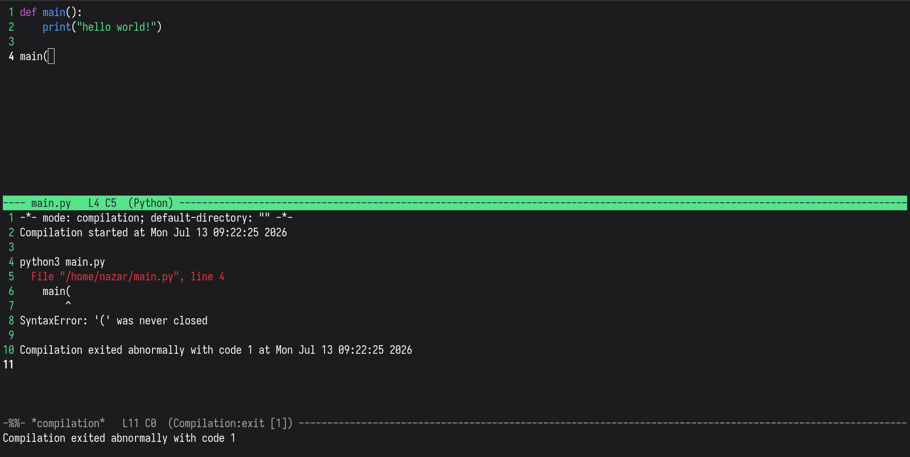
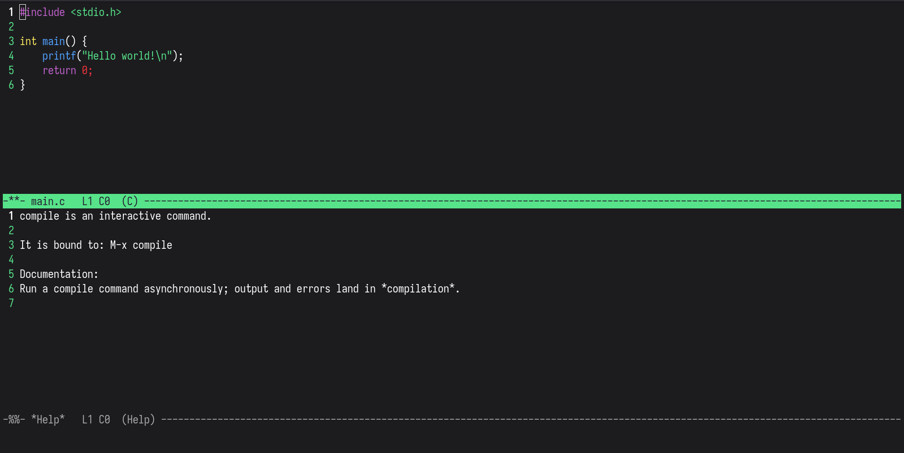
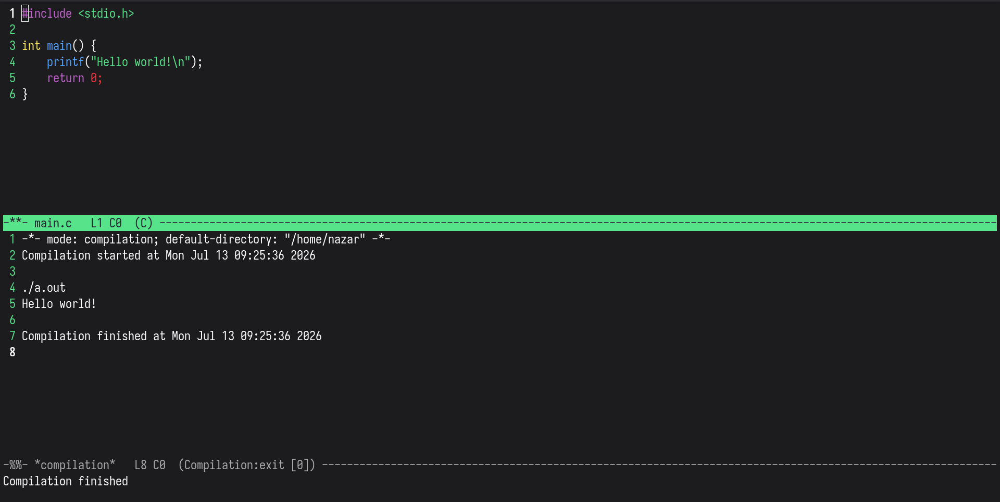
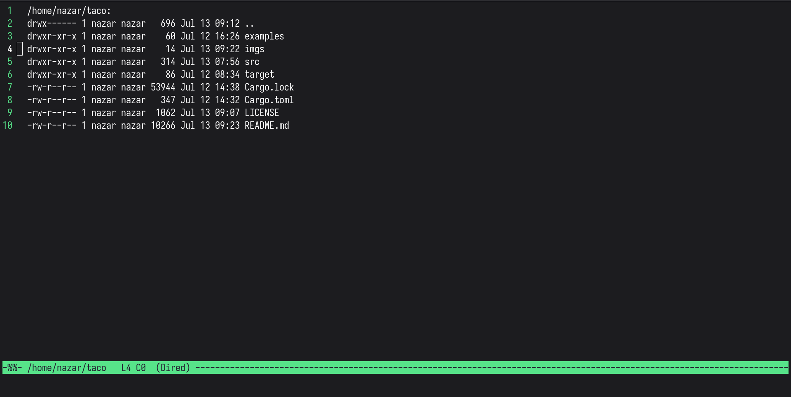

# taco



> [!CAUTION]
> Made with AI use at your own risk

A terminal-only Emacs, built as a small Rust core driving an embedded
[Steel](https://github.com/mattwparas/steel) Scheme interpreter.

The design rule is the same one GNU Emacs follows: the core is a **pure
VM** — buffers (ropey), windows, rendering (crossterm), the event loop,
and a set of narrow native primitives (filesystem, processes, regex,
tree-sitter). Everything you'd call *editor behavior* — the default
keymap, dired, `M-x compile`, the C-h help system, every language mode —
is plain Scheme loaded on top of that contract, and your `init.scm` uses
the exact same functions the built-ins do.

No GUI. No vim emulation. Arrow keys are deliberately unbound — it's
`C-n`/`C-p`/`C-f`/`C-b`, like the tutorial taught you.

## Building and running

```sh
cargo build --release
./target/release/taco            # open *scratch*
./target/release/taco file.rs    # open a file
./target/release/taco src/       # open a directory in dired
```

You'll want:

- **git + a C compiler** — language modes install their tree-sitter
  grammars on first use (`git clone` + compile, cached afterwards).
- **A terminal with the kitty keyboard protocol** (kitty, foot, recent
  wezterm/ghostty) for the full experience: without it some chords are
  physically ambiguous — `C-<backspace>` arrives as plain `DEL`, and
  `C-j` is indistinguishable from `RET`. taco folds the classic legacy
  aliases (`C-/` as `C-_`, `C-SPC` as `NUL`, `ESC` as a Meta prefix)
  either way.

The mouse works: click to move point, drag to select a region, wheel to
scroll.

## Keys

The defaults (all defined in `src/scheme/bootstrap.scm`, rebindable):

| | |
|---|---|
| `C-x C-f` / `C-x C-s` / `C-x C-c` | find file / save / quit |
| `C-x b` / `C-x k` | switch / kill buffer |
| `C-n C-p C-f C-b` `M-f M-b` `C-a C-e` `M-< M->` | movement |
| `C-v` / `M-v` / `C-l` / `M-g g` | scroll / recenter / goto line |
| `C-SPC` `C-w` `M-w` `C-y` `M-y` `C-k` `M-d` | mark, kill ring |
| `C-<backspace>` / `M-backspace` | backward-kill-word |
| `C-s` / `C-r` / `M-%` | isearch / query-replace (regexp) |
| `C-/` | undo |
| `C-u` | universal argument |
| `M-;` | comment-dwim |
| `C-M-h` | mark-defun (select the function at point) |
| `C-x 2` `C-x 3` `C-x 1` `C-x 0` `C-x o` | windows |
| `C-x SPC` / `C-x r t` | rectangle mark / string-rectangle |
| `M-x` | run any command by name |

### Help — `C-h`



| | |
|---|---|
| `C-h c KEYS` | which command a key runs (brief echo) |
| `C-h k KEYS` | full documentation of that command in `*Help*` |
| `C-h x NAME` (alias `C-h f`) | describe a command by name |
| `C-h v NAME` | describe a variable (buffer-locals, options) |
| `C-h a REGEXP` | apropos: matching commands with their bindings |
| `C-h ?` | overview of all of the above |

Dismiss the `*Help*` window with `C-x 1`, or `q` inside it.

### Compile — `M-x compile`



Runs the command **asynchronously**; output streams live into a
read-only `*compilation*` buffer in the other window while you keep
editing. Error messages (rustc, gcc/clang, Python tracebacks, Java
stack traces, make, and generic `file:line:col`) are recognized and
colored as they arrive.

| | |
|---|---|
| `RET` (in `*compilation*`) | visit the error at point |
| `n` / `p` | next / previous message |
| `g` | recompile |
| `C-c C-k` | kill the running compilation |
| `M-g n` / `M-g p` / ``C-x ` `` | next-error / previous-error, from anywhere |

Add your own error patterns from init.scm:

```scheme
(add-compilation-error-regexp
 (list "mytool" "^MYTOOL ([^ :]+) line ([0-9]+)" 1 2 #f "error"))
```

### Dired — directory editing



Opening a directory gives an `ls -la`-style listing. Entry points:
`C-x C-f` on a directory, `C-x C-j` (jump to the current file's
directory, cursor on that file), `C-c f d` (prompt for a directory),
`C-c p D` (project root — nearest `.git` ancestor).

| | |
|---|---|
| `RET` / `o` / `^` | visit / visit other window / up |
| `n` / `p` | move, landing on the file name |
| `m` / `u` / `U` / `% m` | mark / unmark / unmark all / mark by regexp |
| `d` then `x` | flag for deletion, then execute flags |
| `C` / `R` / `D` / `+` | copy / rename-move / delete / mkdir |
| `A` | search marked files for a regexp — results are jumpable like compile errors |
| `!` / `=` / `Z` | shell command on marked / diff / compress |
| `g` / `)` / `q` | refresh / toggle dotfiles / quit |
| `C-c C-q` | **wdired**: edit file names as text; `C-c C-c` applies the renames, `C-c C-k` aborts |

### Language modes

Built in, activated by file extension, each installing its tree-sitter
grammar the first time it's needed:

- **rust-mode** (`.rs`), **c-mode** (`.c` `.h`) — brace-depth
  indentation, `RET` between `{}` opens the block, electric pairs.
- **python-mode** (`.py`) — indent after `:`, dedent on
  `else/elif/except/finally`.
- **scheme-mode** (`.scm` `.ss` `.sld`) — paren-depth indentation
  (your own `init.scm` gets highlighted). Grammar:
  [6cdh/tree-sitter-scheme](https://github.com/6cdh/tree-sitter-scheme).

In all of them `TAB` indents, `M-;` comments, and `C-M-h` selects the
enclosing function (top-level form in scheme-mode) via the syntax tree.

## Configuration — `~/.config/taco/init.scm`

Runs last, over the same API as everything above. A real-world example:

```scheme
(set-option "display-line-numbers" #t)

;; Load a plugin file.
(require "/home/you/.config/taco/vertico.scm")

;; Faces take the 8 ANSI color names: black red green yellow blue
;; magenta cyan white. Unknown face names are tree-sitter capture names.
(set-face-color "mode-line" "green")
(set-face-color "line-number" "green")
(set-face-color "keyword" "magenta")
(set-face-color "comment" "cyan")

;; Rebind anything.
(global-set-key "C-c g" "goto-line")

;; Define your own commands.
(define-command "insert-date"
  "Insert the current time string."
  (lambda () (insert-text (current-time-string))))
(global-set-key "C-c d" "insert-date")

;; Wire up tree-sitter for a language taco doesn't ship a mode for.
(tree-sit-install-language-grammar "go" "https://github.com/tree-sitter/tree-sitter-go")
(tree-sit-enable-for-extension "go" "go")

;; Hooks: run something on every file visit.
(add-hook "find-file-hook"
  (lambda () (message (buffer-file-name))))
```

Key sequence syntax is Emacs-flavored: `"C-x C-f"`, `"M-<"`, `"% m"`,
`"C-<backspace>"`, `"C-M-h"`.

### `examples/`

- **`examples/vertico.scm`** — a Vertico-style vertical completion UI
  for every completable prompt (M-x, files, buffers): candidates listed
  under the prompt, `C-n`/`C-p` to choose, `TAB` to complete/descend,
  `RET` to submit. Pure plugin: it hangs off the minibuffer hooks and
  `(minibuffer-show-candidates ...)`. Install by `require`-ing it (or
  pasting it) from your init.scm.
- **`examples/treesitter-rust.scm`** — the minimal
  install-grammar + extension + faces recipe, kept as a template for
  adding languages (Rust itself is already built in).

## Extending: the Scheme contract in a nutshell

Every native command is callable as a zero-argument function
(`(forward-char)`, `(save-buffer)`, ...). Beyond that, the important
primitives, grouped:

- **Text / point**: `insert-text`, `delete-region!`, `buffer-string`,
  `buffer-lines`, `point`, `goto-char`, `goto-line`, `line-number`,
  `char-after`, `char-before`, `set-mark`, `deactivate-mark`
- **Buffers / windows**: `current-buffer`, `switch-to-buffer` (creates
  if missing), `find-file`, `set-buffer-string!`,
  `set-buffer-read-only!`, `other-window-or-split`,
  `buffer-local-set!`/`-get` (+ `-in` variants targeting a buffer by
  name), `buffer-add-face-span!` (color arbitrary ranges)
- **Modes**: `set-buffer-mode-name`, `use-local-map`, `define-key`,
  `global-set-key`, `define-command`, `add-hook`/`run-hooks`
  (`find-file-hook`, minibuffer lifecycle hooks)
- **Prompts**: `read-string` (with completion kind + continuation),
  `y-or-n-p`, `read-key-sequence`, the whole `minibuffer-*` family for
  completion UIs
- **Processes**: `start-process` (async, streaming callbacks),
  `process-kill`, `process-live?`, `run-shell-command` (synchronous)
- **Files / OS**: `directory-entries`, `rename-file`, `copy-file`,
  `delete-file`, `make-directory`, `read-file-to-string`,
  `regexp-match?`/`regexp-match`/`regexp-match-positions`,
  `diff-unified`, `gzip-file`, `tar-gzip-directory`
- **Tree-sitter**: `tree-sit-install-language-grammar`,
  `tree-sit-enable`, `tree-sit-enable-for-extension`,
  `tree-sit-node-range-at-point`, `set-face-color`
- **Introspection**: `command-names`, `command-doc`, `command-bindings`,
  `buffer-local-keys`

`src/scheme/*.scm` (bootstrap, compile, help, dired, the language
modes) are the reference users of all of it.

## Project layout

```
src/
  main.rs            event loop (poll-based while processes run)
  editor.rs          Editor state: buffers, windows, faces, processes
  buffer.rs          rope + mark + undo + face spans
  dispatch.rs        keymap trie, command execution
  keys.rs mouse.rs   input normalization, drag-select
  render.rs          full-frame renderer (region > syntax > plain)
  process.rs         async subprocess primitive
  treesit.rs         grammar install/compile/load, highlight, node query
  scheme/
    mod.rs           the Rust<->Steel contract (every primitive)
    fs.rs            filesystem/regex/text primitives
    bootstrap.scm    default keymap, hooks, shared helpers
    compile.scm  help.scm  dired.scm
    rust-mode.scm  python-mode.scm  c-mode.scm  scheme-mode.scm
examples/            optional plugins (vertico, tree-sitter template)
```

Load order: `bootstrap.scm` → `compile.scm` → `help.scm` → `dired.scm`
→ language modes → your `init.scm`.

## Tests

```sh
cargo test
```

Every built-in `.scm` file has a loads-cleanly guard (Steel fails a
whole file on one bad identifier), and the big features are covered by
headless end-to-end tests that drive the real key-dispatch path — a
fake compiler streaming into `*compilation*`, dired marking/wdired
renames on a temp tree, the C-h flows, mouse drag-selection. One test
(`tree_sitter_install_and_highlight_rust`) needs network + a C compiler
the first time; everything else runs offline.
